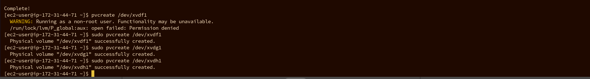
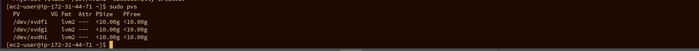
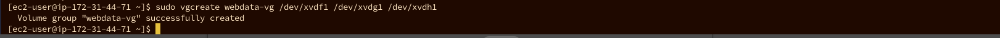
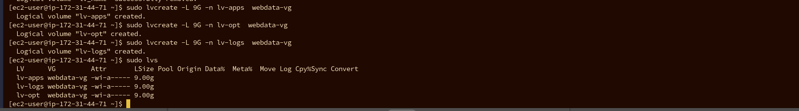
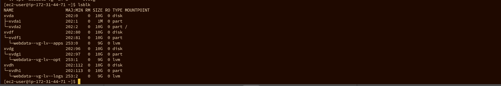
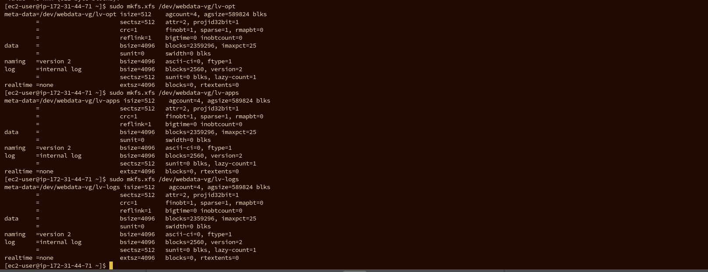
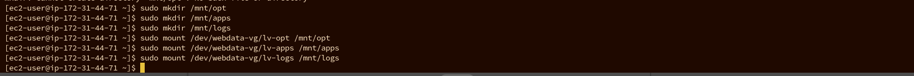

## DavOps Tooling Website Solution 

-  **Step1** 

   **Preparing NFS Server**

   I spined up 3 RHEL-8.6.0_HVM-20220503-x86_64-2-Hourly2-GP2 in AWS called 1. NFS server, WEB1 and WEB2

   Configuring LVM on the NFS server

      I created 3 volumes of 10gb each on the same availability zone with my NFS server and attached them to my NFS server 
 
 

 - I inspected my server to confirm that the 3 disk added was sussessful 

 - Using Gdisk, I created single partition on the 3 disks

 

Using Lsblk to varify the newly created partitions
  

  - I installed LVM2 

  I used Pvcreate to mark each of the 3 disk as physical volume to be used by the LVM

 

  - I used sudo pvs to varify 

    

    - I used vgcreate the create volume group called webdata.vg and varified with **sudo vgs**

    

    - I used lvcreate to create 3 logical volumes from the VG group. lv-opt,lv-apps and lv-logs.

    

    

    - I formated the volumes with xfs extension 

    

-  I created 3 mount points called mnt/opt to mount lv-opt, mnt/logs to mount lv-logs and mnt/apps to mount lv-apps
mnt/apps to be used by webserver, mnt/logs to be used by webserver logs and mnt/opt to be used by jenkins server in next project

Install NFS server and configure it to start on reboot.

 -  I updated my server 

 

 -  I installed NFS server using sudo yum install nfs-utils -y

 -  using sudo systemctl start nfs-server.service, i started it

 - I enebled it with systemctl enable nfs-server.service

I granted permisions that will enable my webservers to read, write and execute files in NFS server
sudo chown -R nobody: /mnt/apps

sudo chown -R nobody: /mnt/logs

sudo chown -R nobody: /mnt/opt

sudo chmod -R 777 /mnt/apps

sudo chmod -R 777 /mnt/logs

sudo chmod -R 777 /mnt/opt

sudo systemctl restart nfs-server.service

I configured access to NFS for clients within the same subnet 

-  sudo exportfs -arv

-  to check which port is used by the NFS and open it using security group 

  

## Configuring backend database as part of 3 tier Architecture  

  step2 

   **To configure database server**

I apined up Ubuntu instance in AWS and called it DB for my database,

- With sudo apt install mysq-server, i installed mysql server and logged in using sudo mysql and created a databse called **tooling**

I created a database user called webaccess and grant it access to do anything on the tooling database only from the webserver subnet cidr

I granted all privileges to the user 

Step 3

 ## Prepering webservers 

 -  I installed NFS client using the command **sudo yum install nfs-utils nfs4-acl-tools -y**

-  I created a directory sudo mkdir /var/www and mounted sudo mount -t nfs -o rw,nosuid 172.31.44.71:/mnt/apps /var/www

- With df -h, i varified that NFS is mounted correctely 

- I edited fstab file with my NFS private ip for consistency after reboot 

-  I installed remi`s repository, Aapache and PHP

`sudo yum install httpd -y

sudo dnf install https://dl.fedoraproject.org/pub/epel/epel-release-latest-8.noarch.rpm

sudo dnf install dnf-utils http://rpms.remirepo.net/enterprise/remi-release-8.rpm

sudo dnf module reset php

sudo dnf module enable php:remi-7.4 -y

sudo dnf install php php-opcache php-gd php-curl php-mysqlnd -y

sudo systemctl start php-fpm

sudo systemctl enable php-fpm

setsebool -P httpd_execmem 1