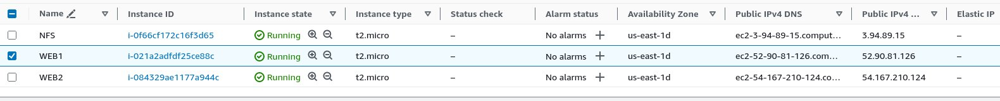
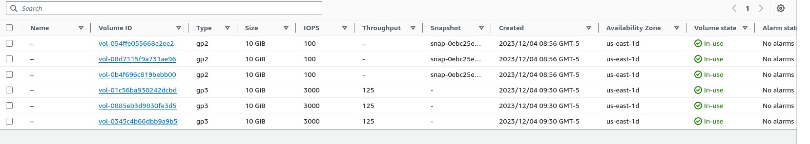
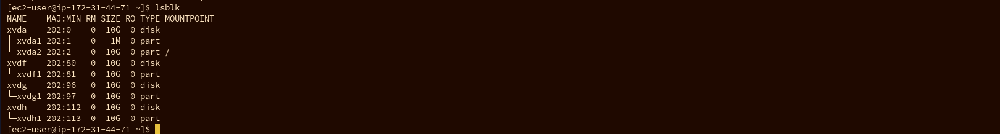
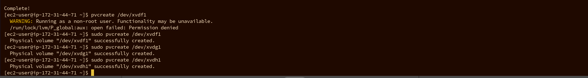
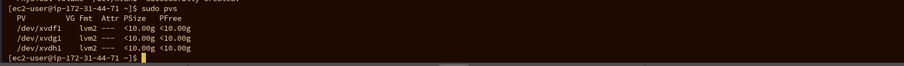
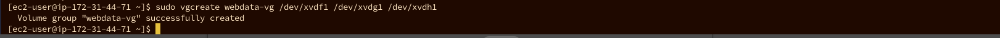
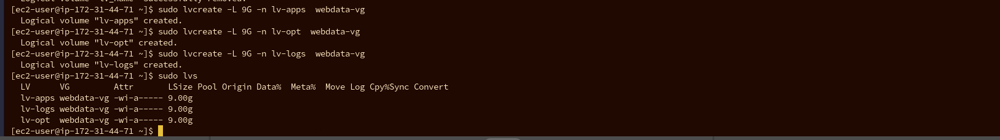
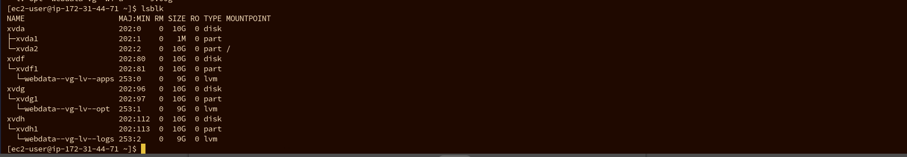
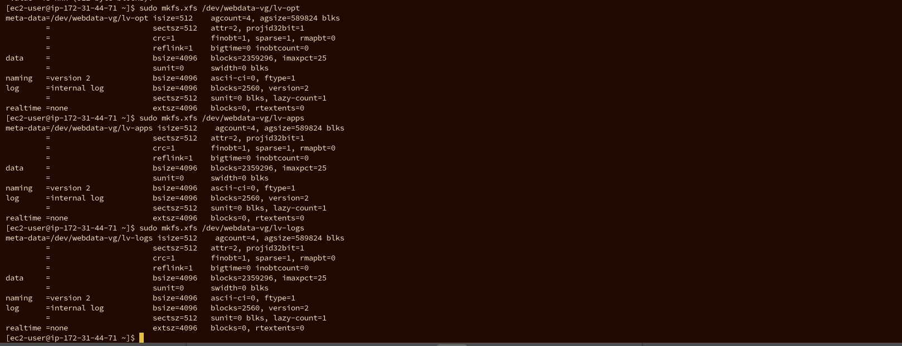
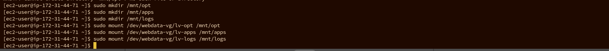

## DavOps Tooling Website Solution 

-  **Step1** 

   **Preparing NFS Server**

   I spined up 3 RHEL-8.6.0_HVM-20220503-x86_64-2-Hourly2-GP2 in AWS called 1. NFS server, WEB1 and WEB2

  

   -  Configuring LVM on the NFS server

      I created 3 volumes of 10gb each on the same availability zone with my NFS server and attached them to my NFS server 
 
 

 - I inspected my server to confirm that the 3 disk added was sussessful 

 - Using Gdisk, I created single partition on the 3 disks

 

 Using Lsblk to varify the newly created partitions 
  

  - I installed LVM2 

  I used Pvcreate to mark each of the 3 disk as physical volume to use used by the LVM

  - I used sudo pvs to varify 

    

    - I used vgcreate the create volume group called webdata.vg and varified with **sudo vgs**

    

    - I used lvcreate to create 3 logical volumes from the VG group. lv-opt,lv-apps and lv-logs.

    

    

    - I formated the volumes with xfs extension 

    

-  I created 3 mount points called mnt/opt to mount lv-opt, mnt/logs to mount lv-logs and mnt/apps to mount lv-apps
mnt/apps to be used by webserver, mnt/logs to be used by webserver logs and mnt/opt to be used by jenkins server in next project

